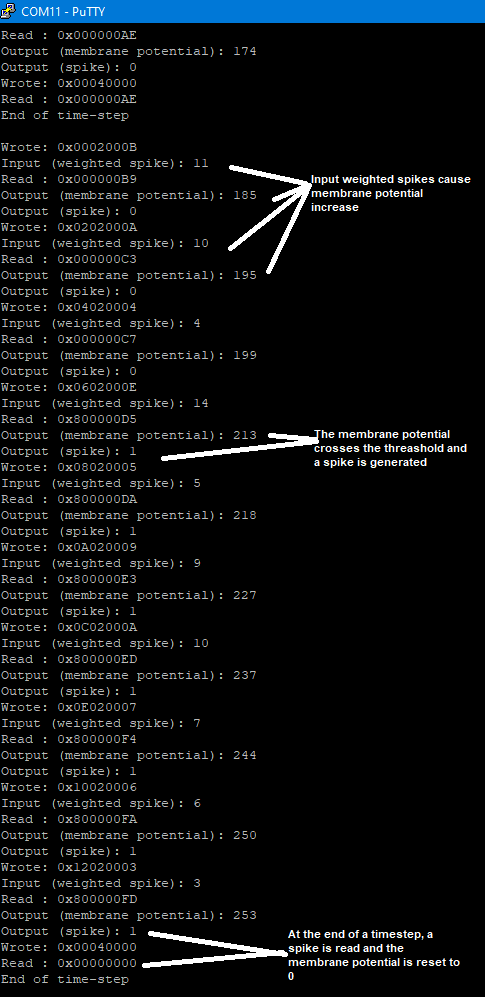

# MicroZed-with-Leaky-Integrated-Fire
A demo of Leaky Integrated and Fire neuron on FPGA (MicroZed)

# Requirements
This project is designed for Vivado 2016.4 and MicroZed 7Z010

# How to run

1. Modify the path to Vivado 2016.4 in `build.bat`
2. Double click to `build.bat` (or via command)
3. Check the file `vivado.log` to ensure the correct project.
4. Open the Project `MicroZed_NASH_SYSTEM/MicroZed_NASH_SYSTEM.xpr`
5. Generate bitstream and export SDK
6. Test C code is in  `src/NASH_SYSTEM_LIF_neuron_test.c`

# Outputs

